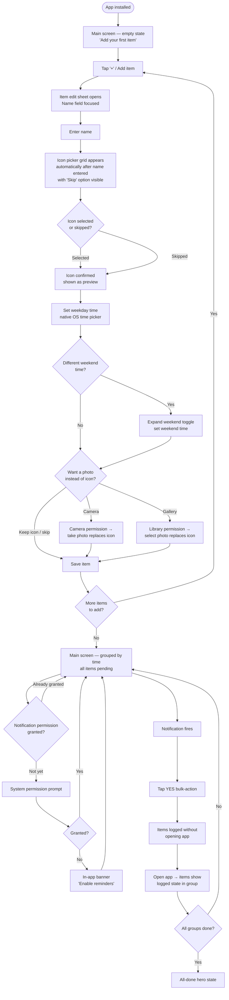
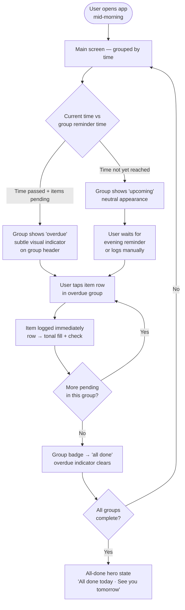
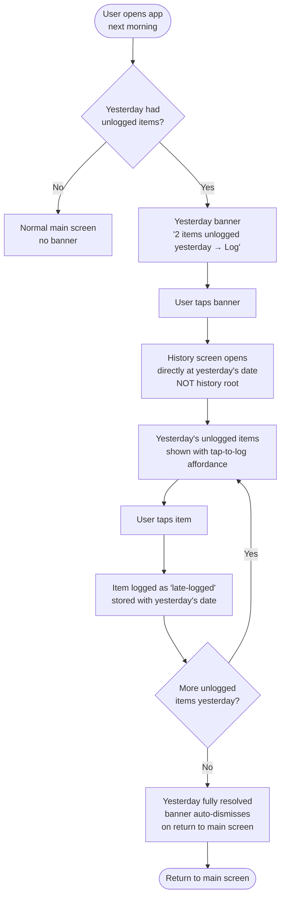
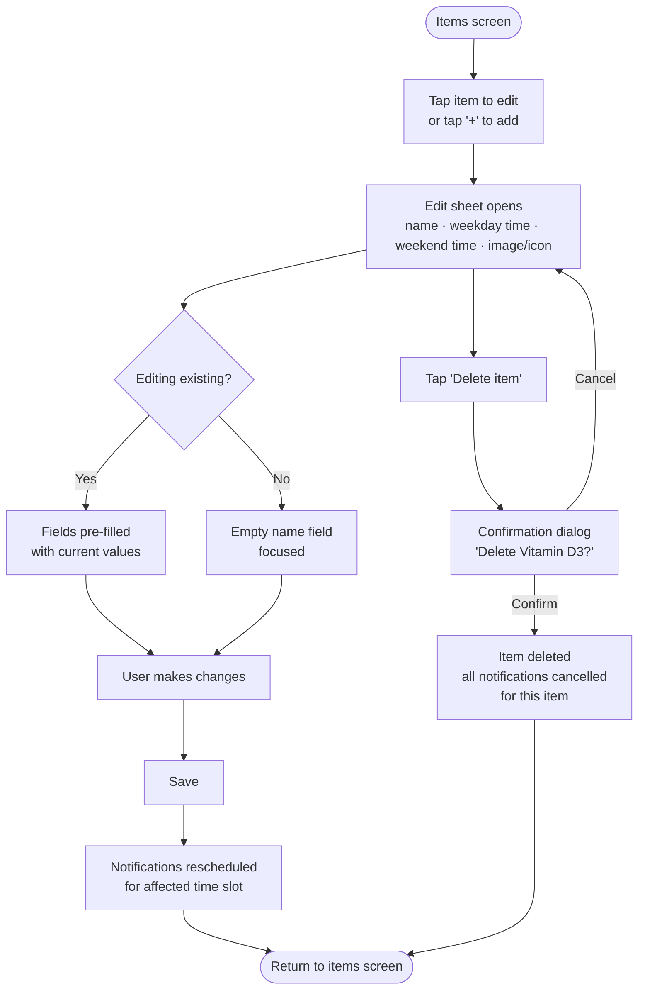

# UX Design Specification Projects

**Author:** Sonja
**Date:** 2026-04-03

---

## Executive Summary

### Project Vision

A deliberately minimal Kotlin Multiplatform mobile app for iOS and Android that does exactly one thing well: helping health-conscious adults reliably take their daily supplements and medications. The market is full of over-engineered medical apps designed for complex prescription regimens. This app's differentiator is deliberate restraint — a habit tracker, not a medical tool. Zero onboarding friction, no account, no cloud, no complexity. All data stays on-device.

Secondary purpose: a clean, portfolio-worthy KMP reference implementation demonstrating shared business logic, local persistence, and platform-abstracted notifications across iOS and Android from a single codebase.

### Target Users

Two specific, known users in a shared household:

- **Sonja** (developer + primary user): values clean minimalism, comfortable configuring once and forgetting. Wants to see her week at a glance. The all-done state matters emotionally — it should feel like a small win.
- **Partner** (casual user): will open the app manually most days rather than acting on notifications. Needs the main screen to be instantly readable with zero thought. Recognizes items by their photos faster than by name. Won't find late logging unless something surfaces it directly.

Both users: 1 medication + 5–6 supplements at 2–3 different time slots. Neither needs medical features, dosage tracking, or drug interaction warnings.

### Key Design Challenges

1. **Late logging discoverability** — The core gap identified: if yesterday had unlogged items, the user won't find late logging unless the main screen surfaces it directly. Root cause: history lives on a separate screen with no badge or indicator. Solution: a contextual "Yesterday" section or banner on the main screen, shown only when relevant, dismissed once resolved.

2. **Status clarity across the day** — Users who dismiss or miss a notification need to clearly see what's still pending hours after the reminder time. The pending state must remain visually prominent well past the scheduled time, not fade or deprioritize over the course of the day.

3. **Weekday/weekend time configuration** — Two reminder times per item is unusual UX. The add/edit flow should start with a single time (the common case) and offer "Different time on weekends?" as a collapsible secondary option, reducing cognitive load for the 80% case.

4. **Notification-denied experience** — Must be a *complete* experience, not a degraded one. One non-blocking dismissible banner surfaces the option to enable notifications; after dismissal, notification status lives in settings only. No persistent nag. No ghost UI for notification states the user will never see.

### Design Opportunities

1. **The "all done" moment** — The daily completion state is a high-impact emotional beat. Keep the item list visible in a checked state (so users see what they accomplished) with a confirmation banner above. A light animation on the final item check adds satisfaction without complexity. This is the primary daily reward; it deserves care.

2. **Item images as identity anchors** — A pill bottle or supplement photo makes each item instantly recognizable, more so than a text name alone. Images are a recognition cue, not decoration. The placeholder/default icon maintains layout consistency when no image is set. This is a real differentiator over plain-list habit apps.

3. **Notification-to-app continuity** — Opening the app from a notification (or after tapping the YES bulk-action) should feel like arriving at confirmation, not starting over. The main screen already showing all items in their current state — some now logged via notification action — provides seamless continuity between the two entry points.

---

## Core User Experience

### Defining Experience

The single most important interaction is the **tap that logs an item as taken**. It happens up to 6 times a day, every day. If that tap feels instant and satisfying, the app succeeds. If it hesitates, requires confirmation, or gives ambiguous feedback, users stop trusting it.

The second most important interaction is **reading the main screen at a glance** — in under 2 seconds, the user should know exactly what's pending and what's done for today.

### Platform Strategy

- **Platforms:** iOS 16+ and Android API 26+, delivered from a single KMP codebase via Compose Multiplatform
- **Interaction model:** Touch-only; no mouse/keyboard consideration required
- **Offline:** Fully offline at all times — no network dependency at runtime
- **Native integration points:** Platform-native time pickers (iOS UIDatePicker wheel, Android Material3 clock dial); platform-native local notifications
- **History placement decision:** History lives on a dedicated screen, not inline on the main screen. Showing past "not-logged" states on the main screen every open risks the "broken chain" psychological effect — users seeing failure prominently may abandon the habit. The main screen is forward-looking (today only); history is opt-in reflection.

### Effortless Interactions

The following actions must require zero thought — no hesitation, no decision, no confirmation:

- Tapping an item to log it (one tap, immediate visual confirmation)
- Reading today's full status at a glance on the main screen
- Acting on a notification YES without opening the app
- Recognising an item by its photo rather than reading the name
- Knowing you're done for the day

### Critical Success Moments

1. **First notification arrives at the right time** — trust in the app is established; the user realises it works without manual intervention
2. **All items logged → "all done" state appears** — the daily reward; the habit loop closes with a satisfying, warm confirmation
3. **User opens app after a missed notification** — sees pending items clearly, logs manually without friction; no guilt, no confusion
4. **User recognises their supplements by photo** — the list feels personal and scannable, not a generic text list
5. **Yesterday's missed items surfaced contextually** — the user discovers they can late-log without hunting for it; recovery feels easy

### Experience Principles

1. **One tap, one outcome** — logging is a commitment with no confirmation dialogs, no undo, no ambiguity. Tap = done.
2. **The screen tells you everything** — no navigation required to understand today's status. The main screen is the complete picture for today.
3. **Absence of friction is the feature** — the best interaction is one the user doesn't notice. Speed and clarity over visual richness.
4. **Late is better than never** — the app accommodates real human behaviour (missing a notification, forgetting) without judgment. Late logging is surfaced proactively, not buried.
5. **Notifications are a convenience, not a dependency** — the app works completely and confidently without them; the manual-open experience is the primary design target.

---

## Desired Emotional Response

### Primary Emotional Goals

**Primary emotion: Calm confidence.** Not excitement or delight-for-delight's-sake. The user opens the app, sees exactly where they stand, taps what they need to, and closes it. They feel in control without effort. The app is invisible in the best way.

### Emotional Journey Mapping

| Moment | Target feeling |
|---|---|
| Opening the app | Oriented — instant clarity, no confusion |
| Tapping to log an item | Satisfied — immediate, definite feedback |
| Hitting "all done" | A small, warm sense of accomplishment |
| Missing a day | Gracefully recovered — not judged, not shamed |
| Setting up a new item | Competent — simple, quick, done |
| Opening from notification | Confirmed — "yes, it worked" |

### Micro-Emotions

- **Confidence over confusion** — the main screen is always unambiguous; users never wonder what they need to do
- **Trust over skepticism** — the app behaves predictably every day; no surprises, no state drift
- **Satisfaction over delight** — the tap response is instant and definitive; small moments of quiet satisfaction, not theatrical delight
- **Accomplishment over anxiety** — completion is celebrated warmly; incompletion is neutral, not alarming

### Design Implications

- *Calm confidence* → clean layout, nothing unnecessary on screen, no badges or counters beyond what's needed
- *Immediate satisfaction* → tap response < 500ms, clear visual state change on logging, no confirmation dialog
- *Warm accomplishment* → the "all done" state is visually distinct and positive, not just a cleared list
- *No guilt* → history is opt-in, not pushed; "not-logged" states are neutral in tone, not red alarms
- *Trust* → consistent visual behaviour every open; logged state looks the same whether triggered by tap or notification action

### Emotional Design Principles

**Emotions to actively avoid:**
- Anxiety about missing doses — this is a habit tracker, not a medical app
- Guilt from visible failure states — no negative history surfaced on the main screen
- Overwhelm from too many indicators or options
- Distrust from slow or ambiguous tap feedback

---

## UX Pattern Analysis & Inspiration

*Skipped — no specific reference apps identified. Design decisions are guided by the experience principles and emotional goals established in previous steps.*

### Anti-Patterns to Avoid

Based on the supplement/habit tracker category:

- **Onboarding walls** — mandatory tutorials, account creation, or multi-step setup before any value is delivered
- **Progress shame** — surfacing streaks broken or days missed in a way that discourages rather than motivates
- **Notification fatigue** — multiple notifications per item, repeated reminders, or nagging prompts to enable permissions
- **Medical UI patterns** — dense data tables, dosage fields, interaction warnings; creates wrong mental model for a habit app
- **Paywall prompts** — upsell banners or premium feature locks that undermine the "just works" experience

### Design Inspiration Strategy

**Adopt:**
- Single-action list items with immediate visual state change (common in task/checklist apps)
- Bottom sheet or modal for item add/edit (keeps navigation shallow)
- Contextual empty states that guide first action without onboarding flow

**Adapt:**
- Native platform time picker pattern — use as-is per PRD (iOS wheel, Android dial), but frame within a clean, minimal edit sheet
- Checkbox/toggle tap pattern — adapt to a whole-row tap target for maximum touch comfort

**Avoid:**
- Tab bar navigation with more than 3 tabs — this app has at most 3 screens; keep navigation minimal
- Swipe-to-delete as the *only* delete path — pair with an edit screen delete option for discoverability

---

## Design System Foundation

### Design System Choice

**Material Design 3 (Material You) with custom theming** — using Material 3 as the structural foundation with a bespoke colour palette and visual tone applied on top.

### Rationale for Selection

- **Native to Compose Multiplatform** — Material 3 components, spacing, elevation, and accessibility defaults are built in; no custom component library needed for a 3-screen app
- **Accessibility by default** — touch targets, Dynamic Type scaling, and contrast requirements are handled by the system; reduces implementation risk for a solo developer
- **Fast to build** — standard components (lists, bottom sheets, buttons, cards) require no custom work; energy goes into the product interactions, not UI primitives
- **Customisable enough** — Material 3's design token system supports a fully custom colour scheme and visual tone without fighting the framework
- **Aligns with emotional goals** — Material 3's expressive surface and tonal elevation support the "calm confidence" feeling; the default expressiveness is tunable toward warmth and restraint

### Implementation Approach

- Use Compose Multiplatform Material 3 component library as-is for all standard UI elements (lists, sheets, dialogs, buttons)
- Define a custom `MaterialTheme` with project-specific colour tokens — do not use the default Material colour scheme
- Platform-specific components (time picker) implemented via `expect`/`actual` as per PRD; styled to feel consistent with the custom theme

### Customisation Strategy

| Token | Direction |
|---|---|
| Colour scheme | Warm neutrals; calm single accent (not default purple/teal); logged/pending states use tonal surfaces, not red/green alarms |
| Typography | System font — San Francisco (iOS), Roboto (Android) — no custom typeface |
| Item row | Full-row tap target; checked state uses tonal background fill, not a checkbox tick |
| "All done" state | Custom warm icon or simple illustration; not a stock Material empty state |
| Surfaces | Low elevation, minimal shadow — clean and uncluttered |

---

## Defining Experience

### 2.1 Defining Experience

> *"Tap to mark it done."*

The core interaction is a checklist tap. The user sees today's items, taps each one they've taken, and it's logged — no confirmation, no form, no next step. The interaction is so obvious it barely feels like an interaction. The app's differentiator is not a novel gesture or pattern; it's the *execution quality* of this one action and its seamless integration with notifications.

### 2.2 User Mental Model

Users arrive with a **checklist mental model** — the same one they'd use with a paper list or a notes app. They expect to see items, tap the ones they've done, and see them visually change. No new paradigm to learn.

Current workarounds users likely employ: notes app lists, alarm labels ("take magnesium"), or memory alone. None provide confirmation. The app's core value over these is *certainty* — you know you took something, rather than just being reminded to.

### 2.3 Success Criteria

- Tap registers with immediate visual change (< 500ms)
- Logged and pending states are unambiguously distinct — not just a colour difference
- No confirmation dialog; no undo prompt
- Item remains visible after logging (not hidden or removed) — progress is visible
- After the final item: "all done" state appears as a natural consequence of the last tap
- Logged items are not re-tappable (read-only in v1 — accepted limitation, not a UX failure)

### 2.4 Novel vs. Established Patterns

**Established** — no user education required. The checklist tap is universally understood. Innovation lives in:
- Notification YES bulk-action writing to the database without opening the app
- Contextual "Yesterday" late-logging surface on the main screen
- The warmth and quality of the "all done" moment

### 2.5 Experience Mechanics

| Stage | Detail |
|---|---|
| **Initiation** | User sees today's item list; pending items are visually prominent with full-row tap affordance |
| **Interaction** | Tap anywhere on the item row — no specific tap zone; full-width target (min 48dp/44pt) |
| **Feedback** | Row transitions immediately to logged state: tonal background fill + check indicator; item name and photo remain visible |
| **Completion** | Last item tapped → "all done" confirmation banner appears above list; all items remain visible in checked state |
| **Edge: notification YES** | App opened after bulk-log via notification shows items already in logged state — no re-logging, seamless continuity |
| **Edge: already logged** | Logged items visible on main screen but interaction is disabled — consistent with read-only history principle |

---

## Visual Design Foundation

### Color System

**Direction: Dusty Indigo**

| Token | Direction |
|---|---|
| Background surface | Warm near-white (light) / deep warm charcoal (dark) |
| Primary accent | Dusty/muted indigo — desaturated, slightly warm-shifted |
| Logged row state | Soft indigo tint fill (~15–20% opacity accent on surface) |
| "All done" banner | Indigo tint background, warm-white text |
| Pending item | Neutral surface — prominence through contrast, no colour |
| History: not-logged | Cool grey or warm-grey — never red; avoids medical alarm association |
| History: logged | Soft indigo tint — same visual language as main screen logged state |
| Error / warning | Muted amber |

### Typography System

- **Typeface:** System font — San Francisco (iOS), Roboto (Android) — no custom typeface; consistent with platform conventions and zero additional dependency
- **Tone:** Clean and readable; no decorative or expressive typefaces
- **Scale:** Material 3 type scale — `displaySmall` for "all done" moment, `titleMedium` for item names, `bodyMedium` for supporting text, `labelSmall` for history state labels
- **Accessibility:** Dynamic Type / system font scaling supported by default; no fixed px sizes

### Spacing & Layout Foundation

- **Base unit:** 8dp/pt grid (Material 3 default)
- **Density:** Spacious — generous row height for touch comfort; not information-dense
- **Item rows:** Minimum 56dp height; full-width tap target
- **Layout feel:** Airy, uncluttered; content breathes — aligns with "absence of friction is the feature" principle
- **Margins:** 16dp horizontal screen margins throughout

### Accessibility Considerations

- All interactive elements minimum 48dp × 48dp touch target
- Logged vs. pending states differentiated by shape/fill AND label, not colour alone
- History states differentiated by icon shape AND label, not colour alone
- Colour contrast: accent on surface meets WCAG AA (4.5:1 for text, 3:1 for UI elements)
- Dark mode supported via Material 3 dynamic colour token system

---

## Design Direction Decision

### Design Directions Explored

Six directions were generated in `ux-design-directions.html`, covering clean list (light), card grid, grouped by time, rich list with mini history, compact dense (dark), and all-done hero (dark). All used the Dusty Indigo palette.

### Chosen Direction

**Grouped by Time + All-Done Hero — Light and Dark**

A hybrid of Directions 3 and 6:

- **Normal state:** Items grouped under their reminder time slot (e.g. 8:00 AM, 9:00 PM, 10:00 PM). Each group displays a "X of Y done" badge that updates as items are logged. Completed groups visually settle — items show the logged tonal state within the group; the badge updates to "all done."
- **All-done state:** Once every item across all groups is logged, the hero completion moment appears — large icon, warm message ("All done today · See you tomorrow"), compact checked list below. Replaces the grouped list at this point.
- **Light + Dark mode:** Both supported via Material 3 dynamic theming with the Dusty Indigo token set.

### Item Image / Icon Strategy

Three options when setting an item image:

1. **Icon picker** — a curated grid of emoji-style icons (pill, leaf, bottle, capsule, etc.); opens automatically after the item name is entered with a prominent "Skip" option; requires no permissions; always available
2. **Camera** — take a photo; requests camera permission on first use
3. **Gallery** — select from photo library; requests media permission on first use

**Default placeholder:** When no image is set and no icon is selected, the placeholder matches the visual style of the icon picker icons — consistent rounded-square format, warm-tinted background, neutral glyph. This ensures visual consistency whether or not users customise their items.

If both camera and gallery permissions are permanently denied, the icon picker remains fully available as it requires no system permissions.

### Design Rationale

- **Grouped by time** mirrors how users mentally organise their routine ("morning stuff," "evening stuff") and matches the notification grouping model — what the notification says maps directly to what they see in the app
- **All-done hero** gives the daily completion moment the emotional weight it deserves — the primary habit-reinforcement beat of the entire app
- **Icon picker** makes the app feel personal and visually rich even for users who never take a photo; reduces the friction of customisation to a single tap on a grid

### Implementation Approach

- Main screen: `LazyColumn` with sticky or non-sticky group headers per time slot
- Group badge state: derived from logged count vs. total count per time slot
- All-done state: composable swap — when `allLogged == true`, render hero composable; otherwise render grouped list
- Icon picker: a bottom sheet with a scrollable grid of vector/emoji icons stored as app assets; selected icon ID stored alongside image path in the item schema (null image path + icon ID = icon picker result)

---

## User Journey Flows

### Journey 1: First Setup & First Log

Icon picker opens automatically after name entry (with Skip). Notification permission requested on first launch. Notification YES bulk-action logs items without opening app.

### Journey 2: Manual Log After Missed Notification

Groups whose reminder time has passed but have pending items show a subtle "overdue" indicator on the group header. Upcoming groups remain neutral.

### Journey 3: Late Logging (Yesterday's Items)

Yesterday banner deep-links directly to yesterday's date view in history — not the history root. Banner auto-dismisses on return to main screen once all items are resolved.

### Journey 4: Add / Edit Item

### Journey Patterns

| Pattern | Behaviour |
|---|---|
| **Entry** | All primary actions reachable from main screen in ≤ 2 taps |
| **Feedback** | State change is immediate and local (row-level); no full-screen reload |
| **Overdue signal** | Groups whose reminder time has passed with pending items get a subtle header indicator; upcoming groups remain neutral |
| **Deep-link** | Yesterday banner navigates directly to yesterday's date in history, not the history root |
| **Progressive disclosure** | Weekend time toggle and photo option appear after primary fields; icon picker auto-opens with Skip available |
| **Contextual surface** | Yesterday banner appears only when relevant; auto-dismisses once resolved |
| **Notification reschedule** | Triggered silently on every item save and delete — no user action required |

---

## Component Strategy

### Design System Components (Material 3 — use as-is)

`LazyColumn` · `ListItem` · `BottomAppBar` · `NavigationBar` · `ModalBottomSheet` · `AlertDialog` · `FloatingActionButton` · `TopAppBar` · `Text` / type scale · `LinearProgressIndicator` · `Scaffold`

### Custom Components

#### `ItemRow`
The core daily interaction component.

- **States:** `pending` · `logged` (tonal fill + check) · `disabled` (logged, non-tappable)
- **Anatomy:** Thumbnail/icon (40dp rounded square) + item name + time label + check circle (28dp)
- **Interaction:** Full-row tap target (min 56dp height); no tap on logged items
- **Accessibility:** Content description = "[Item name], [state]"; logged items announce "already logged"

#### `TimeGroupSection`
Groups items under their reminder time slot.

- **States:** `pending` (badge = "X pending") · `overdue` (badge = "X overdue", subtle amber-tinted header text, derived from current time > slot time) · `done` (badge = "all done")
- **Anatomy:** Time label + state badge + `ItemRow` list
- **Behaviour:** Overdue state derived at render time — no extra storage needed

#### `AllDoneHero`
Completion state composable — shown when all groups are logged.

- **Anatomy:** Large icon (52dp) + primary message ("All done today") + secondary line ("See you tomorrow") + compact checked item list
- **Transition:** Animated swap from grouped list; light fade/scale in
- **States:** Single state — rendered only when `allLogged == true`

#### `YesterdayBanner`
Contextual late-logging surface on the main screen.

- **States:** `visible` (yesterday has unlogged items) · `hidden` (resolved or nothing to recover)
- **Anatomy:** Amber-tinted icon + message + "Log →" action text
- **Behaviour:** Tap deep-links to history screen at yesterday's date; auto-dismisses on return once all resolved
- **Accessibility:** Announced as actionable banner with destination context

#### `ItemEditSheet`
Bottom sheet for add/edit item flow.

- **Anatomy:** Name field → icon picker grid (auto-opens after name entry, Skip visible) → weekday time row → "Different time on weekends?" toggle → weekend time row (conditional) → photo option row (camera / gallery) → Save / Delete
- **States:** `add` (empty fields) · `edit` (pre-filled)
- **Platform:** Native time picker via `expect`/`actual`

#### `IconPickerGrid`
Curated emoji-style icon selector.

- **Anatomy:** Scrollable grid of rounded-square icon tiles; selected tile gets indigo tint border; prominent "Skip" button
- **Content:** ~24 icons covering common supplement/medication types
- **Storage:** Selected icon ID stored in item schema alongside image path; null = default placeholder

#### `HistoryDayView`
Per-date view in history screen.

- **Anatomy:** Date header + item list with 4-state indicators per item
- **States per item:** `logged` (indigo tint) · `late-logged` (lighter indigo tint + "late" label) · `not-logged` (warm grey) · `no-data` (empty, no indicator shown)
- **Late-log interaction:** Unlogged items tappable only for yesterday (1 day back limit)

#### `NotificationDeniedBanner`
One-time in-app notification permission prompt.

- **States:** `visible` · `dismissed` (persisted in local preferences; never re-shown after dismissal)
- **Anatomy:** Bell icon + short message + "Enable" action link
- **Behaviour:** Shown max once; tap leads to system settings

### Component Implementation Strategy

- All custom components built with Material 3 design tokens (colour, spacing, shape) from the Dusty Indigo theme
- Component state is derived from SQLDelight data — no separate UI state store for log status
- `expect`/`actual` used only where platform divergence is required (time picker inside `ItemEditSheet`)
- Composable swap pattern for `AllDoneHero` vs grouped list — driven by a single `allLogged: Boolean` derived state

### Implementation Roadmap

| Phase | Components | Needed for |
|---|---|---|
| 1 — Core | `ItemRow` · `TimeGroupSection` · `AllDoneHero` | Main screen daily log flow |
| 1 — Core | `ItemEditSheet` · `IconPickerGrid` | Add/edit item journey |
| 1 — Core | `YesterdayBanner` | Late logging discoverability |
| 2 — Supporting | `HistoryDayView` | History screen |
| 2 — Supporting | `NotificationDeniedBanner` | Permission degraded state |

---

## UX Consistency Patterns

### Button Hierarchy

| Level | Component | Usage |
|---|---|---|
| Primary | `FilledButton` (indigo) | Single primary action per screen (Save item) |
| Secondary | `OutlinedButton` | Secondary confirm actions |
| Tertiary / text | `TextButton` (indigo) | Navigation actions ("Log →", "Enable") |
| Destructive | `TextButton` (amber, not red) | Delete item — in edit sheet only, never on list |

**Rule:** No screen ever has two filled buttons. One primary action maximum per context.

### Feedback Patterns

| Situation | Pattern |
|---|---|
| Item logged | Immediate row state change (tonal fill + check); no toast required |
| All items done | `AllDoneHero` composable swap — the feedback IS the state |
| Item saved | Sheet dismisses; item appears in list — implicit confirmation |
| Item deleted | Sheet dismisses; item removed from list — no undo in v1 |
| Late log recorded | Row state updates to `late-logged` in history view |
| Notifications rescheduled (lapse) | Subtle `Snackbar` — "Reminders rescheduled" — auto-dismiss, no action |

**Rule:** Never use a success toast for actions where the result is visually self-evident.

### Form Patterns

- **Name field:** Single-line text input; auto-focused on sheet open; name is the only required field
- **Time picker:** Native platform picker opened via row tap; current value shown as row label; no inline text field
- **Weekend toggle:** Collapsed by default ("Different time on weekends?"); expands to reveal second time row; state preserved on edit
- **Validation:** Name field required; time fields default to 8:00 AM if untouched; no inline blocking error messages for optional fields
- **Save button:** Always enabled — no blocking validation gate; empty name handled by OS keyboard

### Navigation Patterns

- **Structure:** 3-tab `NavigationBar` — Today / History / Items
- **Launch destination:** Today tab always; no badge on any tab
- **History tab:** Opens to current day by default; `YesterdayBanner` is the late-log discovery mechanism — not a nav badge
- **Sheet navigation:** Add/edit opens as `ModalBottomSheet`; dismisses on save or back gesture
- **History deep-link:** `YesterdayBanner` tap navigates directly to yesterday's date via navigation argument — not tab root selection

### Empty States

| Screen | Empty state |
|---|---|
| Main screen — no items configured | Warm illustration + "Add your first item" + filled button |
| Main screen — all done | `AllDoneHero` (completion state, not an empty state) |
| History — no data yet | "No history yet — come back tomorrow" — neutral, not alarming |
| Items screen — no items | Same prompt as main screen empty state |

**Rule:** Empty states always provide one clear next action. Never strand the user.

### Deletion Confirmation

- **Pattern:** `AlertDialog` with item name in title ("Delete Vitamin D3?")
- **Actions:** "Delete" (amber text) + "Cancel" (dismisses)
- **Rule:** Swipe-to-delete is never the sole deletion path — always paired with edit sheet delete option
- **Effect:** Deleting an item cancels all its pending notifications immediately

### Modal & Overlay Patterns

- **Bottom sheet:** Add/edit item only; drag-to-dismiss enabled
- **Alert dialog:** Destructive confirmation only (delete item)
- **Snackbar:** System-level feedback only (lapse recovery); auto-dismiss; no action button
- **In-app banners:** `YesterdayBanner` and `NotificationDeniedBanner` — persistent until resolved or dismissed; not overlays

---

## Responsive Design & Accessibility

### Responsive Strategy

Phone-only app — no tablet, no desktop, no web target. Layout adapts across the real range of phone screen sizes using Compose Multiplatform `WindowSizeClass`:

| Screen size | Width | Approach |
|---|---|---|
| Small phones (iPhone SE, compact Android) | ~360dp | Single column; content margins reduce to 12dp; no layout overflow allowed |
| Standard phones (primary design target) | 375–393dp | 16dp margins; full component sizes as specified |
| Large phones (Pro Max, large Android) | 414dp+ | Extra width absorbed by margins; no multi-column introduced |

Single-column layout throughout. No breakpoints in the traditional web sense.

### Accessibility Strategy

**Target: WCAG AA** — appropriate for a personal daily-use app; meaningful compliance without AAA overhead.

| Requirement | Implementation |
|---|---|
| Touch targets | Min 48×48dp on all interactive elements — enforced by row height (56dp) and check circle sizing (28dp with generous tap area) |
| Colour contrast | Dusty indigo accent on warm-white surface meets 4.5:1 for text; 3:1 for UI elements |
| Non-colour state distinction | Logged vs pending: tonal fill + check icon + label change — not colour alone |
| History state distinction | 4 states distinguished by icon shape + label, not colour alone |
| Dynamic Type / font scaling | System font throughout; no fixed `sp` sizes; Material 3 type scale adapts automatically |
| VoiceOver / TalkBack | `ItemRow` content description: "[Name], [pending/logged]"; `AllDoneHero` announces "All items logged for today"; banners announced as actionable with destination context |
| Screen reader order | Natural top-to-bottom Compose render order; no custom traversal needed |
| Dark mode | Fully supported via Material 3 dynamic theming |

### Testing Strategy

| Test type | Approach |
|---|---|
| Device testing | iPhone SE (small), iPhone 15 (standard), one large Android — Sonja's own devices |
| Accessibility | VoiceOver (iOS) and TalkBack (Android) — manual walkthrough of all 4 core journeys |
| Font scaling | Test at 150% and 200% system font scale; no layout overflow allowed |
| Dark mode | Both themes verified on each platform |
| Notification flows | YES action tested when app is force-quit — critical for NSE (iOS) and BroadcastReceiver (Android) |

### Implementation Guidelines

- Use `sp` for all text sizes (scales with system font preference automatically via Material 3)
- Use `dp` for all spacing and touch targets
- All `@Composable` functions with tap affordances must expose a `modifier` parameter to allow minimum size enforcement via `Modifier.minimumInteractiveComponentSize()`
- Semantic annotations: `Role.Checkbox` on `ItemRow`, `Role.Button` on banners, `contentDescription` on all image/icon elements
- No functionality conveyed by animation alone — state changes must be readable without motion
